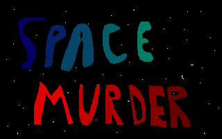

# SPACE MURDER



Premise: You're the captain of a spaceship.  You're corrupt, but only
you know that.  You have a crew.  A delegation is coming aboard, and you
have struck a deal with one of its members.  The deal is... MURDER.

The murderer in the delegation needs to murder another member of the
delegation, but needs your help to do it without getting noticed.  As
captain you have the complete overview of where everyone is on your
ship, as well as how they react under different circumstances.  You have
the power to give orders to both your crew and the murderer.  All orders
to the crew must make sense, e.g., you cannot order a guard to move to
an empty room just to get rid of the guard.


## Example level

```
    ,-----,---,
    |     /   |
,---| ,---| c |
|   | |   |   |
| M / |   |---'
|   | | V |
'---| |   |
    | |   |
    |G/   |
,---'/'---|
|         |
|    C    |
|         |
'---------'
```

- M: Murderer
- V: Victim
- C: Captain
- G: Guard
- c: Counselor

Movements:

- G starts pointing up.  For each step:
  - If G cannot move further due to a wall or a door, turn around.
  - Otherwise, move one tile in the current direction.

Relations:

- G will move toward c if seen and stay there until given new orders.
- M will murder V if in the same room (takes one step).

Solution:

- At t = 14, ask c to visit C.  Timed so that G notices c as G is
  walking towards the top of the map after passing the door to M's
  quarters.
- At t = 20, ask M to visit and murder V.
- At t = 31, ask M to return to M's quarters.

Success!


## Example captain names

Auto-generate these.

- Captain Monocles f'Antissanté
- DiscoMan DeAngelo
- Bumbers 4K
- Charelius XXIT
- Ulla Fregat


## Example movements

### X will move towards Y when seeing Y

Potential reasons:

- X is deeply in love with Y
- X is angry with Y
- X needs to deliver Z to Y, where Z is an object that Y needs

### X walks back and forth in a corridor

Potential reasons:

- X is a guard
- X is pacing
